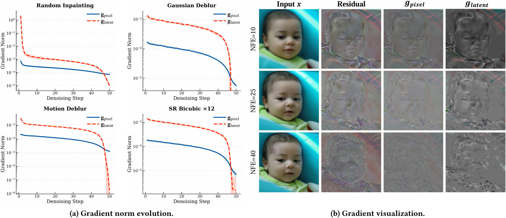
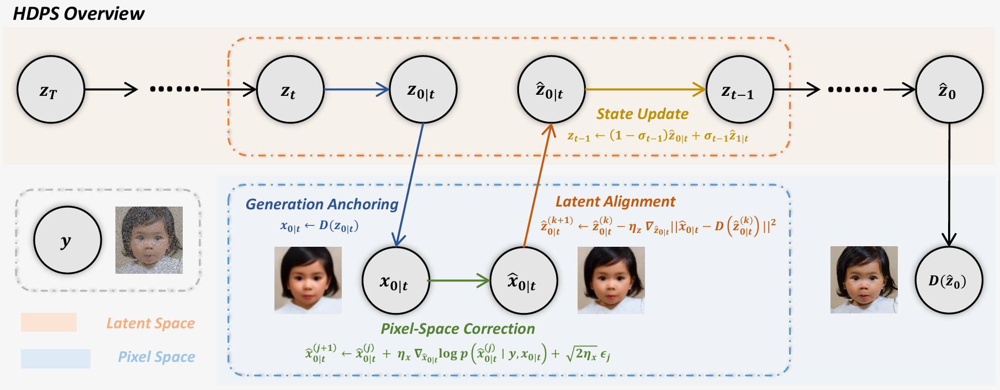
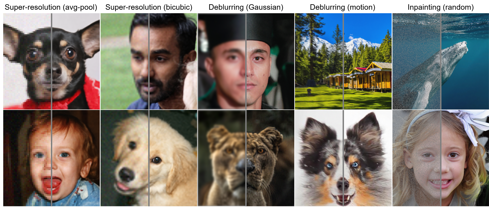

# [ACM MM 2026] Hybrid-Domain Posterior Sampling for Inverse Problems via Latent Flow Matching

## 📝 [Paper](https://arxiv.org/abs/2607.xxxx) | 🏆 **ACM Multimedia 2026**

Official PyTorch implementation of **"Hybrid-Domain Posterior Sampling for Inverse Problems via Latent Flow Matching"** (**HDPS**).

---

## 🚀 Highlights

* **Identify "First-Order Manifold Blindness":** We formalize the geometric bottleneck where rank-deficient decoder Jacobians mathematically erase high-frequency measurement updates in latent-space solvers.
* **Decoupled Hybrid-Domain Optimization:** We break single-domain limitations by splitting roles—using uncompressed pixel space for precise data fidelity and latent space for generative prior modeling.
* **Artifact-Suppressed Latent Alignment:** Instead of error-prone direct encoding, we employ a test-time decoder inversion that acts as a structural filter to prevent semantic drift.
* **Training-Free Plug-and-Play Solver:** HDPS achieves state-of-the-art accuracy on extreme linear inverse problems (e.g., $ \times12 $ SR) without any retraining or model modifications.

---

## 📖 Introduction

Pre-trained Latent Flow Models (LFMs) excel at compressed-space image synthesis but struggle with high-fidelity conditional generation (inverse problems). This stems from a fundamental domain mismatch: while the generative prior resides in the compressed latent space, physical measurement consistency belongs to the uncompressed pixel space.

The prevailing solution back-propagates gradients through the decoder ($D$) to update latent codes. However, because the latent space retains only $\approx 2.1\%$ of the original pixel degrees of freedom, the decoder Jacobian $J_D$ is severely rank-deficient. Consequently, high-frequency structural updates orthogonal to the decoder manifold are mathematically erased. We define this fundamental geometric bottleneck as **First-Order Manifold Blindness**.


*Figure 1: Latent vs. pixel-space gradient dynamics. (a) Latent gradients decay by orders of magnitude and vanish in late stages, while pixel gradients remain stable. (b) Pixel gradients are spatially precise; latent gradients lose structural information after passing through the decoder bottleneck.*

To break this bottleneck, we propose **Hybrid-Domain Posterior Sampling (HDPS)**. HDPS systematically decouples physical data consistency from semantic prior evolution by alternating between two domains:

* **Pixel-Space Correction:** Uses annealed Langevin dynamics in the uncompressed pixel space to absorb precise, full-rank measurement updates orthogonal to the manifold.
* **Latent Alignment:** Employs an optimization-based decoder inversion to project the refined image back onto the generative trajectory, acting as a structural filter that suppresses artifacts without causing semantic drift.

Theoretical analysis guarantees that HDPS bypasses first-order manifold blindness through a second-order mechanism leveraging the decoder's non-linear curvature, setting a new state-of-the-art in high-resolution image restoration.


*Figure 2: Overall pipeline of the proposed Hybrid-Domain Posterior Sampling (HDPS) framework.*

---

## ⚡ Quick Start

### Environment Setup

First, clone this repository and install requirements.

```bash
git clone https://github.com/.../HDPS.git
cd HDPS
conda create -n hdps python==3.10
conda activate hdps
pip install -r requirements.txt
```

> The provided requirements.txt installs torch with CUDA 11.8. If you are using other versions, please change it.

For the motion blur problem, clone the repository below.

```bash
git clone https://github.com/LeviBorodenko/motionblur.git
```

### Examples

You can quickly check the results using the following examples.

**Example 1. Super-resolution x12 (avg-pool) / Dog** 

```bash
python solve.py \
    --img_size 768 \
    --img_path samples/afhq_example.png \
    --prompt "a photo of a closed face of a dog" \
    --task sr_avgpool \
    --deg_scale 12 \
    --efficient_memory
```

**Example 2. Super-resolution x12 (bicubic) / Human** 

```bash
python solve.py \
    --img_size 768 \
    --img_path samples/ffhq_example.png \
    --prompt "a photo of a closed face" \
    --task sr_bicubic \
    --deg_scale 12 \
    --efficient_memory
```

**Example 3. Gaussian Deblur / Animal** 

```bash
python solve.py \
    --img_size 768 \
    --img_path samples/div2k_example.png \
    --prompt "a high quality photo of bengal tiger, break, enclosure, floor, lay, relax, stone, tiger, white, zoo" \
    --task deblur_gauss \
    --deg_scale 61 \
    --efficient_memory
```

> The prompt (after "a high quality photo of") is extracted by DAPE from the given measurement.

For each task, expected results are


### How to choose task and solver

You can freely change the task and solver using the following arguments:

- `task` : sr_avgpool / sr_bicubic / deblur_gauss / deblur_motion / inpainting
- `method` : latentdaps / resample / flowchef / flowdps / flair

If you want to change the amount of degradation, change `deg_scale`. For SR tasks, it refers to the downscaling factor, and for deblurring tasks, it refers to the kernel size.

### Efficient inference

If you use `--efficient_memory`, the text encoder will pre-compute text embeddings and be removed from the GPU.

This allows us to solve inverse problem with a single GPU with VRAM of 24GB.

---

## 🙏 Acknowledgements

Our repository is modified from and built upon:

- [DAPS](https://arxiv.org/abs/2407.01521): https://github.com/zhangbingliang2019/DAPS
- [FlowDPS](https://arxiv.org/abs/2503.08136): https://github.com/FlowDPS-Inverse/FlowDPS
- [FLAIR](https://arxiv.org/abs/2506.02680): https://github.com/prs-eth/FLAIR

We gratefully acknowledge their contributions to the field.

---

## 📄 Citation

If you find our work useful, please kindly consider citing:

```bibtex
@inproceedings{wu2026hybrid,
  title={Hybrid-Domain Posterior Sampling for Inverse Problems via Latent Flow Matching},
  author={Wu, Hongjie and Xie, Yiping and Lv, Jiancheng},
  booktitle={Proceedings of the 34th ACM International Conference on Multimedia},
  pages={...},
  year={2026}
}
```
